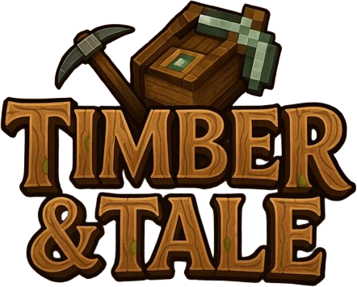

<div align="center">
  

  <h1>Timber & Tale SMP ServerPack</h1>


This is the official server resource pack for the [Timber & Tale SMP](https://www.planetminecraft.com/server/timber-amp-tale-smp/) Minecraft server, containing assets used on the server. <br/> 
It is automatically applied when players join the server.

</div>


## 📦 Contents

- ⚙️ Server-specific resource modifications
- ✨ Custom item textures and models

## ⚡ Requirements

- **Minecraft Version:** 1.21.4 or later

## 💾 Installation

### 🔧 For Server Administrators
1. 📂 Place the resource pack in your server's root directory
2. 📄 Update `server.properties`:
```properties
resource-pack= resource-pack=https://drive.google.com/uc?export=download&id=16Ggr5s52JaK1K6tZpCyOQDsU0LaUJJaK
resource-pack-sha1=e24791e38fa5049ef603ee4e20aa4c82ab2801d0
require-resource-pack=true
```

### 👥 For Players
The resource pack will be automatically downloaded when you join the Timber & Tale SMP server. 

**Manual Installation (Optional):**
1. 📥 Download the latest release from [Releases](../../releases)
2. 📂 Place in your Minecraft resource packs folder:
   #### For Minecraft Launchers:
    -  CurseForge: `%appdata%\.cf\minecraft\instances\<Your Instance>\resourcepacks`
    -  Modrinth: `%appdata%\.modrinth\instances\<Your Instance>\resourcepacks`
   #### For vanilla Minecraft:
   -  🪟 Windows: `%appdata%\.minecraft\resourcepacks`
   -  🍎 Mac: `~/Library/Application Support/minecraft/resourcepacks`
   -  🐧 Linux: `~/.minecraft/resourcepacks`
3. ✅ Enable in Minecraft: Options → Resource Packs

## 🏆 Credits

- **Server:** [Timber & Tale SMP](https://www.planetminecraft.com/server/timber-amp-tale-smp/)
- **Pack Maintainer:** [MaddaFox](https://github.com/MaddaFox)

## 📜 License

[](./LICENSE)

This work is licensed under a [Creative Commons Attribution-NonCommercial-ShareAlike 4.0 International License](https://creativecommons.org/licenses/by-nc-sa/4.0/deed.en).

**You are free to:**
- ✅ **Share** — copy and redistribute the material in any medium or format
- 🔄 **Adapt** — remix, transform, and build upon the material

The licensor cannot revoke these freedoms as long as you follow the license terms.

**Under the following terms:**
- 📝 **Attribution** — You must give appropriate credit, provide a link to the license, and indicate if changes were made
- 🚫 **NonCommercial** — You may not use the material for commercial purposes
- 🔗 **ShareAlike** — If you remix, transform, or build upon the material, you must distribute your contributions under the same license

See the [LICENSE](./LICENSE) file for the full license text

## 💬 Support

For issues or questions:
- 💭 Join our Discord: [Invite URL](https://discord.gg/AM5rYpBpRF)
- 🐛 Open an issue: [Issues](../../issues)
- 🎮 Contact server staff in-game